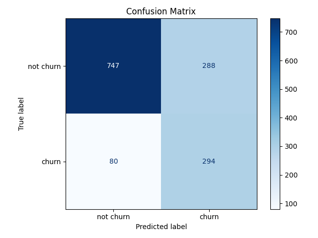
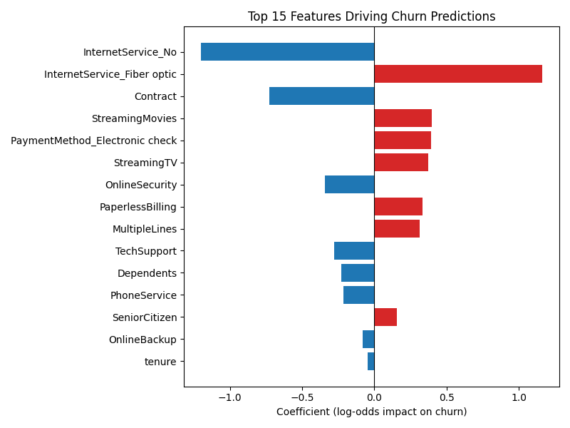

# Telco Customer Churn Prediction

A machine learning project for predicting customer churn in a telecommunications company using logistic regression.

## 📋 Description

This project analyzes telecommunication company customer data and builds a model to predict the probability of customer churn. The model helps identify high-risk customers for proactive retention efforts.

## 🎯 Features

- Data preprocessing with missing value handling
- Categorical variable encoding
- Logistic regression model training
- Comprehensive model quality evaluation
- Feature importance analysis

## 📊 Dataset

The project uses the **WA_Fn-UseC_-Telco-Customer-Churn.csv** dataset from Kaggle, which contains information about:
- Customer demographics
- Subscribed services
- Account information
- Churn status (target variable)

## 🔧 Requirements

```
pandas
scikit-learn
matplotlib
```

Install dependencies:
```bash
python -m venv venv
source venv/bin/activate
pip install -r requirements.txt
```

## 🚀 Usage

1. Download `WA_Fn-UseC_-Telco-Customer-Churn.csv` from Kaggle and place it in the project root (the file is not tracked in git — see [Dataset](#-dataset))

2. Run the script from the project root:
```bash
python src/churn_analysis.py
```

3. Metrics are printed to stdout; confusion matrix and feature importance plots are saved to `outputs/`

## 📈 Workflow

### 1. Data Loading and Preparation
- Load CSV file
- Remove customer identifier (`customerID`)
- Convert target variable `Churn` to binary format (1/0)

### 2. Feature Preprocessing

**Numerical Data Processing:**
- Convert `TotalCharges` to numeric format
- Fill missing values with zeros

**Binary Features:** Transform to 0/1 for the following columns:
- Partner, Dependents, PhoneService, PaperlessBilling
- OnlineSecurity, OnlineBackup, DeviceProtection
- TechSupport, StreamingTV, StreamingMovies, MultipleLines

**Ordinal Features:**
- `Contract`: Month-to-month (0), One year (1), Two year (2)

**Categorical Features:** One-hot encoding for:
- gender
- InternetService
- PaymentMethod

### 3. Model Training
- Data split: 80% training set, 20% test set
- Algorithm: Logistic Regression
- Parameters: `max_iter=5000` for convergence

### 4. Quality Evaluation

The model is evaluated using the following metrics:

- **Recall**: Proportion of correctly identified churn cases
- **F1-score**: Harmonic mean between precision and recall
- **ROC-AUC**: Area under the ROC curve

### 5. Results Analysis

**Confusion Matrix:**
- True Negative: Customers correctly classified as "will not churn"
- False Positive: False alarm for churn
- False Negative: Missed churn cases
- True Positive: Correctly predicted churn cases


## 🔍 Model Output

Two models are trained and compared: a **baseline** logistic regression and a **class-balanced** one (`class_weight='balanced'`), since churn is an imbalanced classification problem (~27% positive class) where recall matters more than raw accuracy.

| Metric | Baseline | Class-balanced |
|---|---|---|
| Recall | 0.559 | **0.786** |
| F1-score | 0.605 | 0.615 |
| ROC-AUC | 0.843 | 0.842 |

Class-balancing trades some precision for a large recall gain — for a churn-prevention use case, catching more at-risk customers is usually worth the extra false alarms.

**Confusion matrix (class-balanced model):**



**Feature importance (class-balanced model):**



## 💡 Results Interpretation

- **Internet service** is the strongest signal: customers with no internet service churn far less, fiber optic customers churn more (possibly reflecting price sensitivity or service issues)
- **Longer contracts** (`Contract`, encoded ordinally as month-to-month=0 / one year=1 / two year=2) are a strong negative predictor of churn — locked-in customers rarely leave
- **Electronic check payment** method correlates with increased churn risk
- **ROC-AUC ≈ 0.84** shows the model separates churners from non-churners reasonably well regardless of the class-weight setting — balancing mainly shifts the decision threshold, not the model's discriminative power

## ⚙️ Possible Improvements

- Hyperparameter tuning (GridSearchCV)
- Testing other algorithms (Random Forest, XGBoost)
- Feature engineering to create new features
- Cross-validation for more reliable evaluation
- Threshold optimization for different business scenarios